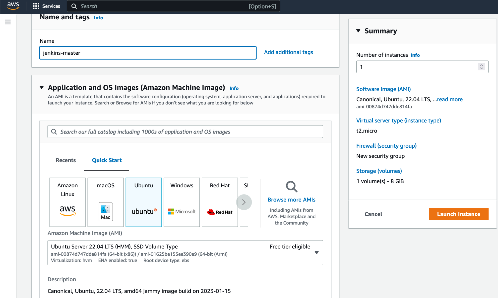
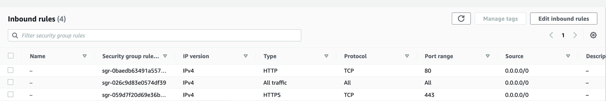
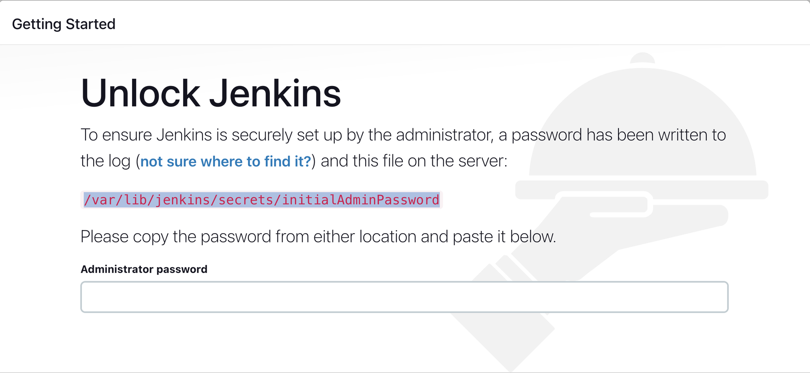
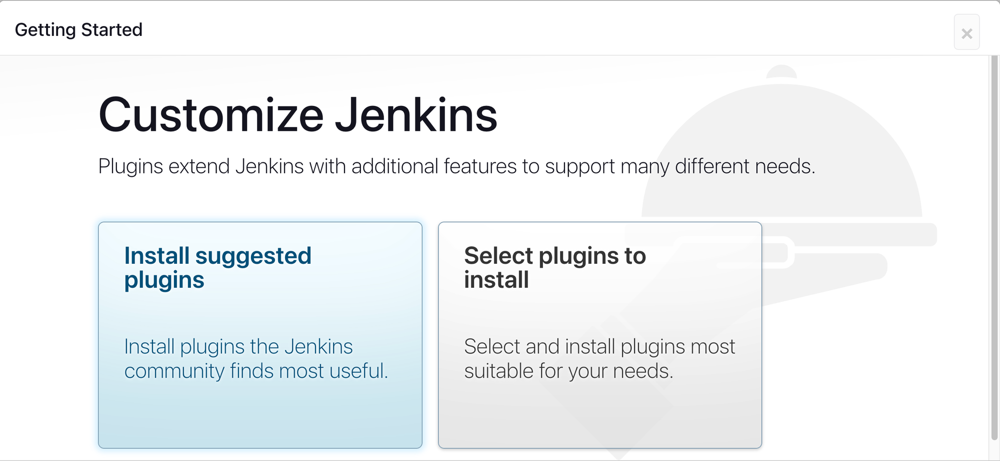
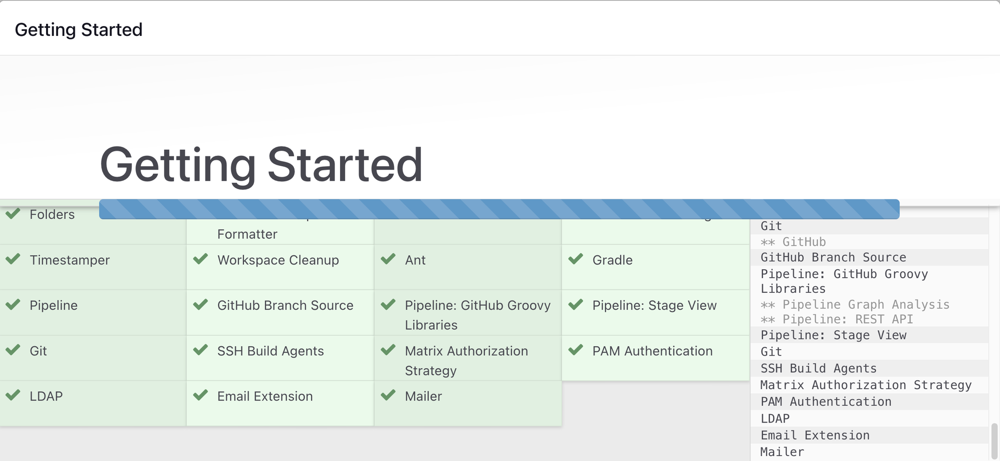
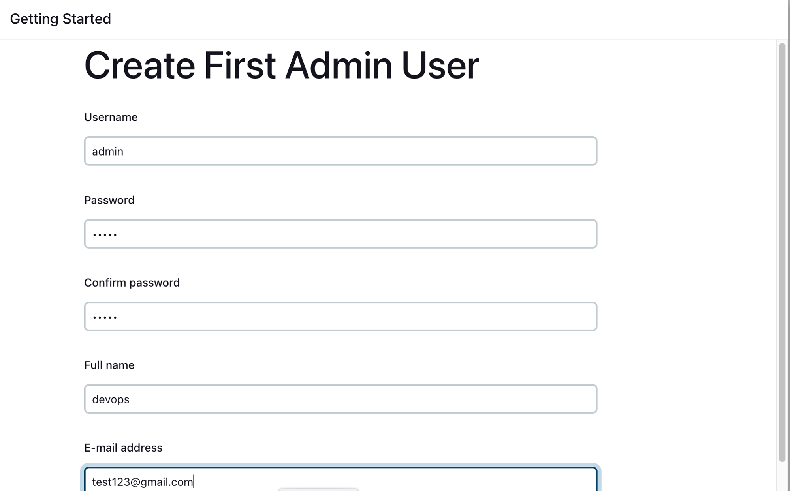
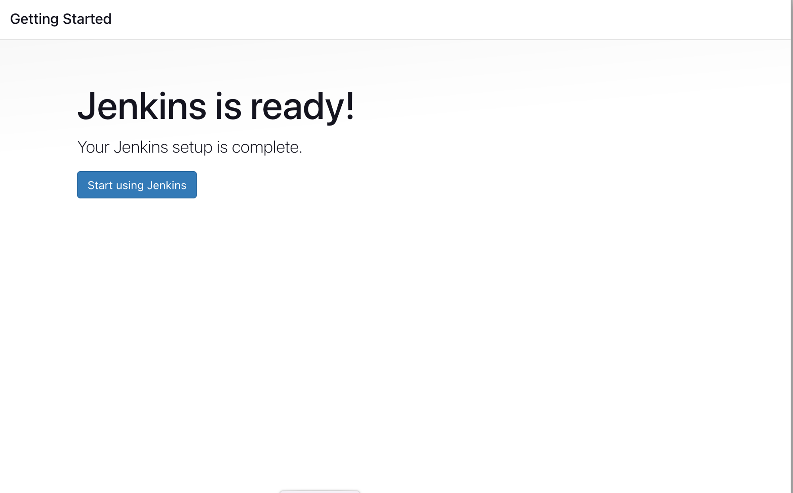

# Install Jenkins on EC2 Instance


### **AWS EC2 Instance**

- Go to AWS Console
- Instances(running)
- Launch instances



- EC2 > Instances > Click on
- In the bottom tabs -> Click on Security
- Security groups
- Add inbound traffic rules as shown in the image



- You can allow only TCP protocol and port: 8080

### **Install Jenkins.**

Pre-Requisites:

- Java (JDK)

**Run the below commands to install Java and Jenkins**

Install Java

```powershell
sudo apt update
sudo apt install openjdk-17-jre
```

Verify Java is Installed

```bash
java -version
```

Now, you can proceed with installing Jenkins

```bash
curl -fsSL https://pkg.jenkins.io/debian/jenkins.io-2023.key | sudo tee \
  /usr/share/keyrings/jenkins-keyring.asc > /dev/null
echo deb [signed-by=/usr/share/keyrings/jenkins-keyring.asc] \
  https://pkg.jenkins.io/debian binary/ | sudo tee \
  /etc/apt/sources.list.d/jenkins.list > /dev/null
sudo apt-get update
sudo apt-get install jenkins

```

- *Note: ** By default, Jenkins will not be accessible to the external world due to the inbound traffic restriction by AWS. Open port 8080 in the inbound traffic rules as show below.

### **Login to Jenkins using the below URL:**

http://ec2_public_ip:8080 [You can get the ec2-instance-public-ip-address from your AWS EC2 console page]

Note: If you are not interested in allowing `All Traffic` to your EC2 instance 

1. Delete the inbound traffic rule for your instance 

2. Edit the inbound traffic rule to only allow custom TCP port `8080`

After you login to Jenkins, - Run the command to copy the Jenkins Admin Password - `sudo cat /var/lib/jenkins/secrets/initialAdminPassword` - Enter the Administrator password



## Installing Jenkins via docker  (Access through localhost)

Docker Command

> docker run -p 8080:8080 -p 50000:50000 -d -v jenkins_home:/var/jenkins_home  jenkins/jenkins:lts-jdk17
> 

Get into Jenkins container to access the secrets 

```bash
dokcer exec -it <container id> bin/bash
```

then get the secret key by `sudo cat /var/lib/jenkins/secrets/initialAdminPassword`

### **Click on Install suggested plugins**



Wait for the Jenkins to Install suggested plugins


Create First Admin User or Skip the step [If you want to use this Jenkins instance for future use-cases as well, better to create admin user]



Jenkins Installation is Successful. You can now starting using the Jenkins


### After installing the required plugins Jenkins needs to be restarted.

Once you are done with the above steps, it is better to restart Jenkins.

```bash
http://<ec2-instance-public-ip>:8080/restart
```

To check Jenkins running port on instance

```bash
ps -ef | grep jenkins
```

## If the instance IP changes

If the user closes the EC2 instance and restarts the instance again. The instance gets a new public IP.

- Go to configure system.
- **Under Jenkins Location set the Jenkins URL to the new IP address of new server.**
- Then restart Jenkins.